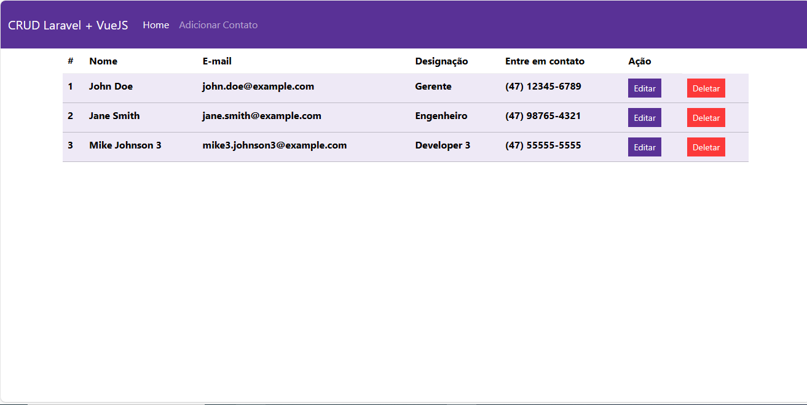
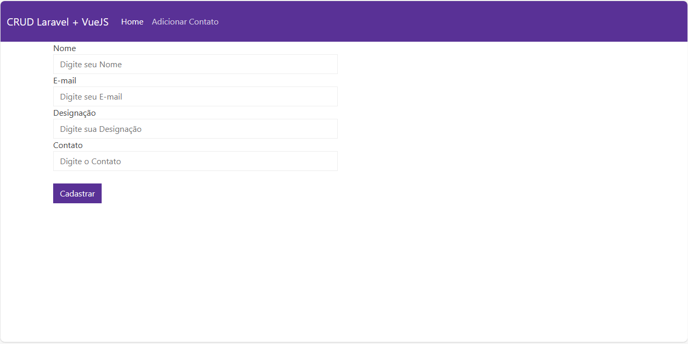
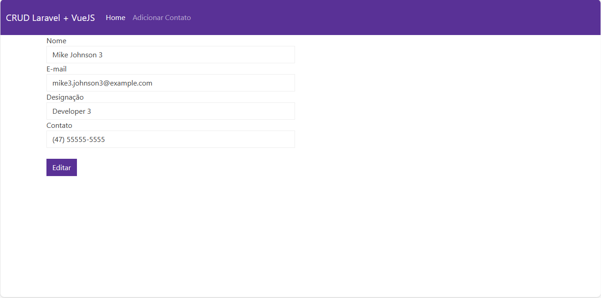

# CRUD de contatos desenvolvido com Back-end Laravel e Front-end VueJS

* Foi criado um repositório para deixar front-end VueJS e o back-end Laravel juntos chamado: crud_contatos_laravel_vue

## Sumário
* Requisitos
* Como Rodar os Projetos
* Comandos usados para desenvolver os projetos
* Imagens do projeto

## Requisitos

- Git
- PHP
- Composer
- VueCLI
- Node
- Apache + Workbench ou xampp e phpmyadmin
- Navegador de internet

## Como Rodar os Projetos

* Copie a URL de Clone no GitHub
* Entre em na pasta do seu computador que você que que fique o projeto apague o que esta na barra de pesquisa digite cmd
* Depois de abrir o prompt com o caminho da sua pasta digite: git clone <url_do_projeto>
* Abra os projetos no VS Code;
* Abra dois teminais um para cada caminho de projeto;
* Para iniciar o projeto laravel digite: php artisan serve
* Para iniciar o projeto VueJS digite: npm run serve

## Comandos usados para desenvolver os projetos
- Criar o projeto front-end: vue create fullstack-crud
- Instalando a biblioteca npm i axios ( Funciona de forma parecida com o Ajax )
* É usado o Botswatch: [Bootswatch: Pulse](https://bootswatch.com/pulse/)
* É usado o vue router também: npm install vue-router@next
* Depois foi digitado o comando: npm install
* Tive que mudar o nome do componente Header para HeaderVue porque estava dando um erro;
* A princípio o name no export do componente precisa ser igual ao nome do arquivo;
* Comandos usados no desenvolvimento do back-end:
- Usado para criar o projeto: composer create-project laravel/laravel laravel_api
- php artisan make:controller ContactController
- php artisan make:model Contact
-- Comentei essa linha no php.ini: ( ;extension=mysqli ) para para de dar erro no comando acima;
-- Comente essa também: ( ;extension=pdo_oci )
-- Após comentar consegui criar o model e criar as tabelas no MySQL
- Como não criou a migration automaticamente usei esse comando para criar: php artisan make:migration create_contacts_table --create=contacts
- Instalei uma extenção do postman no VS code para fazer testes de requisição a API;
- Adicionei esse framework vue para por mascara no campo de contato: `npm i -S vue-the-mask`
-- Foi importado esse framework no arquivo main.js
-- import VueTheMask from 'vue-the-mask'
-- .use(VueTheMask)
-- Adicionei isso no input de contato: v-mask="'(##) #####-####'"

## Imagens do projeto

### Listagem de contatos cadastrados

### Página para adicionar contatos

### Página para editar contatos
